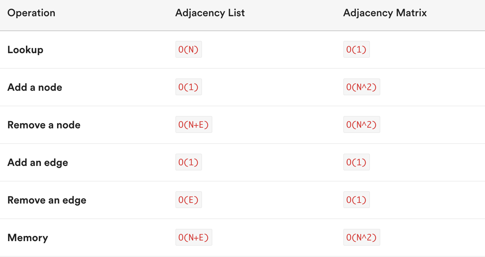
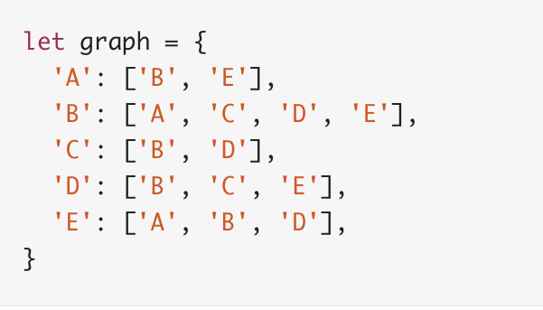
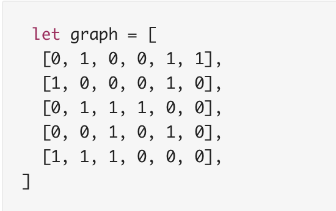

# Graphs  

### What is a graph?  
A graph is a powerful data structure composed of nodes and edges. Nodes store data (e.g., locations on a map) and edges represent relationships between the nodes (e.g., the distance/routes from location to another). Graphs differ from trees in that trees represent data that is heirarchal in nature with parent/children relationships, while graphs represent relationships more generally; a node can have many edges to other nodes and there is no parent/child relationship. Graphs may be undirected or directed. Undirected graphs represent relationships that are always reciprocal; the edges do not point from one node to another. Directed graphs represent relationships that do not have to be reciprocal; the edges do point from one node to another. 

### Implementation
There are two ways to implement graphs in code that differ in Big-O efficiency: an adjacency list and an adjacency matrix. An adjacency list uses a collection of arrays and is the more commonly used graph representation. Each node has its own array, which lists all other nodes it is connected to. An adjacency matrix is represented by a two-dimensional array; each subarray is a node and the values in the subarrays represent edges to other nodes. 

#### Adjacency List

#### Adjacency Matrix - 1 represents an edge, 0 represents a lack of an edge

### Examples

### Interview questions
Common interview questions that you may be asked about graphs will often center around methods of graph traversal. The two common methods of traversing graphs are the breadth first search and depth first search algorithms. In breadth first search, we visit each node that is connecting to the root node before proceeding to the next level of nodes. BFS tries to stay as close to the starting point as possible before moving through the next parts of the graph and going into subsequent nodes. In depth first search, we start at the root and explore as far as possible along each branch before backtracking. Depth first search tries to get as far away as possible from the starting point, visiting each node until it hits a dead end and then starting over. It is important to know the structure of the graph and the problem you are trying to solve. If you know the value you're looking for is closer to the start of the graph, breadth first is faster than depth first. If the graph is very wide but not too deep, depth first will be more efficient. Some common questions include finding the shortest path from one point to another, checking whether a graph is strongly connected, or finding family members in family trees.

### Relevant resources
https://my.generalassemb.ly/activities/403

https://medium.com/@codingfreak/graph-data-structure-interview-questions-and-practice-problems-22d5cd488855

https://stackabuse.com/graph-data-structure-interview-questions/

https://www.cs.usfca.edu/~galles/visualization/BFS.html

https://www.cs.usfca.edu/~galles/visualization/DFS.html

https://www.techiedelight.com/breadth-first-search/

https://www.techiedelight.com/depth-first-search/
